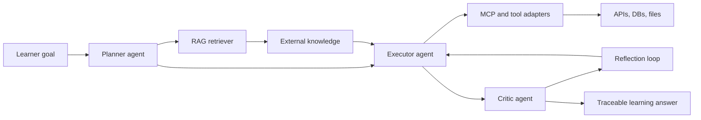

# Socartes

Socartes is an independent agent-native learning workspace for turning complex study goals into traceable plans, grounded answers, tool-assisted research, and self-correcting review loops.

This repository is intentionally standalone. It uses its own code, assets, services, and clean project history.

Live frontend reference: [https://sc.tckr.top/chat](https://sc.tckr.top/chat)

## Project Overview

Socartes focuses on explainable learning workflows. A learner can set a goal, inspect how agents divide the work, see which external knowledge was retrieved, review tool outputs, and compare the final answer against critic feedback.

The current repository contains a lightweight static prototype that demonstrates the product surface and architecture without requiring a backend service.

## Project Screenshots


## Agentic AI Capabilities

| Capability | Socartes Implementation |
| --- | --- |
| Multi-Agent: Planner / Executor / Critic role separation | Planner decomposes the learning goal, Executor performs grounded synthesis, and Critic audits accuracy, gaps, and next revisions. |
| RAG (Retrieval-Augmented Generation): external domain knowledge reference | Retrieval panels show domain notes, citations, and confidence metadata before a response is accepted. |
| MCP / Tool Use: external API, DB, filesystem integration | Tool cards model how Socartes can call external APIs, query a knowledge database, and read or write local study artifacts through controlled adapters. |
| Reflection / Self-Correction: agent self-evaluation and revision loop | Reflection events capture what the critic challenged, what changed, and which claims still need evidence. |

## Architecture



## Repository Structure

```text
.
+-- index.html
+-- styles.css
+-- scripts.js
+-- assets/
|   +-- screenshots/
|       +-- architecture.svg
|       +-- chat.png
|       +-- overview.svg
|       +-- workspace.svg
+-- .gitignore
+-- LICENSE
+-- README.md
```

## Local Preview

Open `index.html` directly in a browser, or serve the folder with:

```bash
python3 -m http.server 4173
```

Then open `http://localhost:4173`.

## Roadmap

- Add a real multi-agent orchestration runtime.
- Connect the RAG layer to a vector database and citation store.
- Implement MCP-compatible adapters for search, document storage, and local files.
- Persist reflection traces as reusable learner memory.
- Add evaluation tests for groundedness, tool-call safety, and revision quality.

## License

MIT
