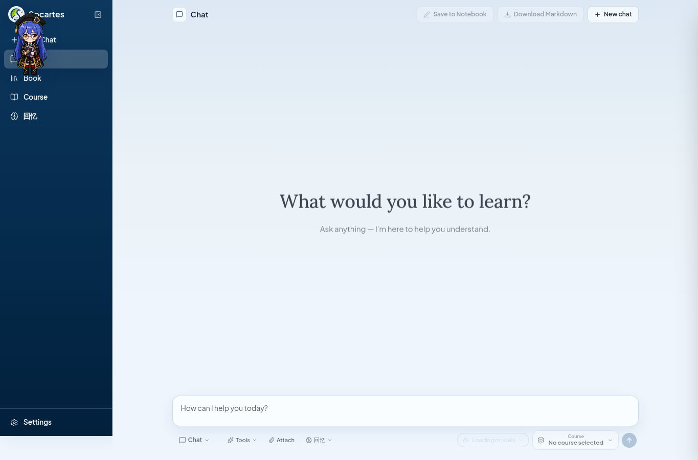
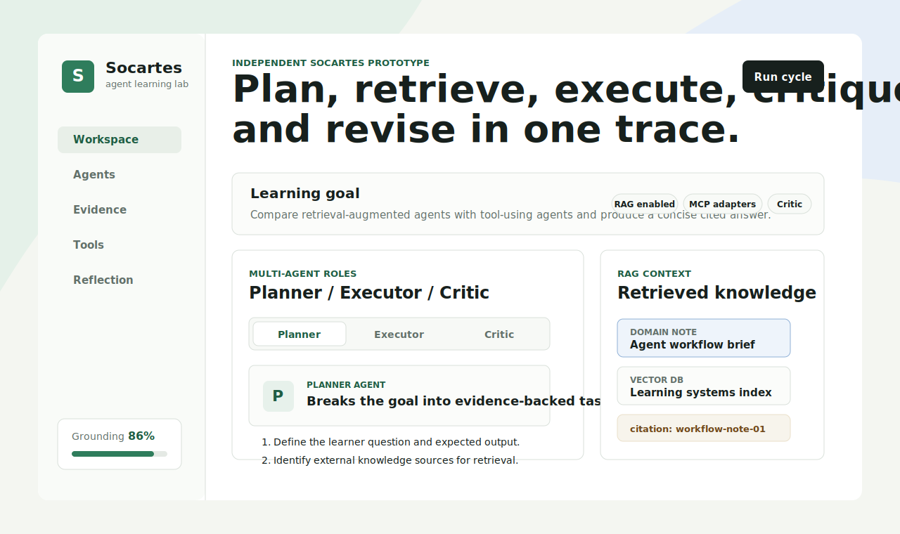
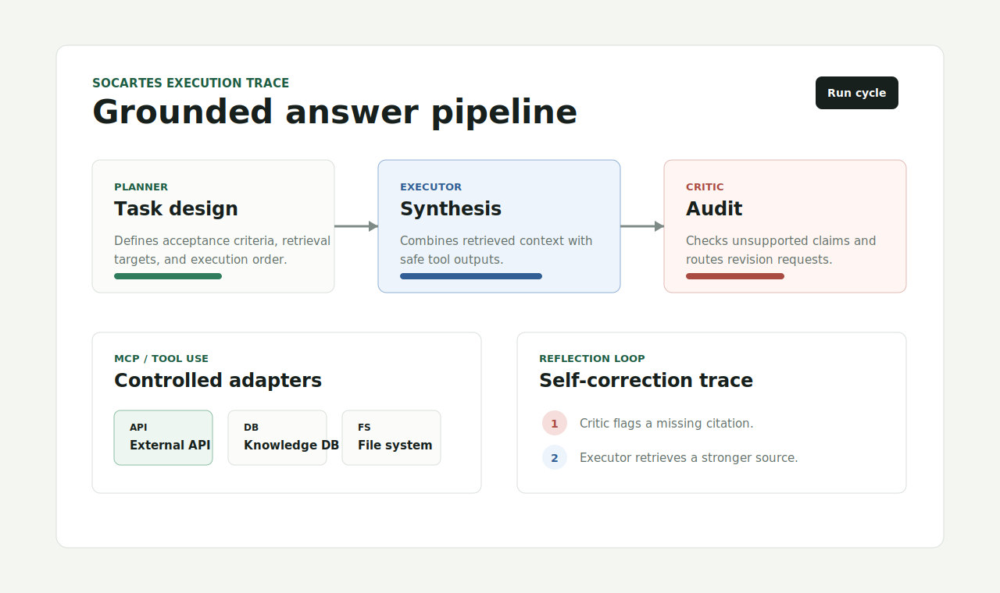
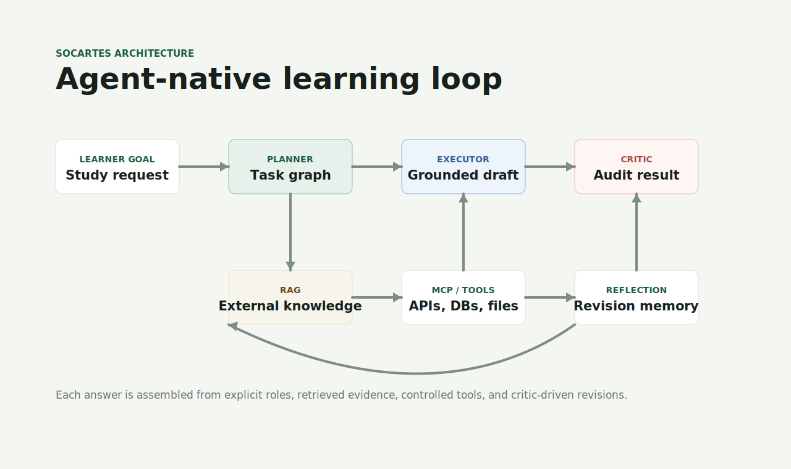
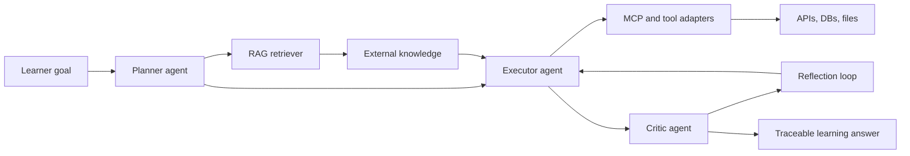

# Socartes

Socartes is an independent agent-native learning workspace for turning complex study goals into traceable plans, grounded answers, tool-assisted research, and self-correcting review loops.

This repository is intentionally standalone. It uses its own code, assets, services, and clean project history.

Live frontend reference: [https://sc.tckr.top/chat](https://sc.tckr.top/chat)

## Project Overview

Socartes focuses on explainable learning workflows. A learner can set a goal, inspect how agents divide the work, see which external knowledge was retrieved, review tool outputs, and compare the final answer against critic feedback.

The current repository contains a lightweight static prototype that demonstrates the product surface and architecture without requiring a backend service.

## Project Screenshots









## Agentic AI Capabilities

| Capability | Socartes Implementation |
| --- | --- |
| Multi-Agent: Planner / Executor / Critic role separation | Planner decomposes the learning goal, Executor performs grounded synthesis, and Critic audits accuracy, gaps, and next revisions. |
| RAG (Retrieval-Augmented Generation): external domain knowledge reference | Retrieval panels show domain notes, citations, and confidence metadata before a response is accepted. |
| MCP / Tool Use: external API, DB, filesystem integration | Tool cards model how Socartes can call external APIs, query a knowledge database, and read or write local study artifacts through controlled adapters. |
| Reflection / Self-Correction: agent self-evaluation and revision loop | Reflection events capture what the critic challenged, what changed, and which claims still need evidence. |

## Agent Roles and Implementation

Socartes is designed around a small set of specialized agents. Each agent has a narrow responsibility, explicit inputs, and a structured output so the learning process can be inspected instead of hidden inside one opaque chat response.

### Planner Agent

The Planner Agent turns a learner request into an executable study plan.

Core functions:

- Interprets the learner's goal, constraints, target depth, and desired format.
- Breaks the goal into ordered subtasks such as retrieval, comparison, explanation, and review.
- Defines what evidence is required before the Executor can produce an answer.
- Creates acceptance criteria that the Critic can later check.

Implementation:

- In the current prototype, the planner is represented by the `roles.planner` state in `scripts.js` and the Planner tab in `index.html`.
- The UI shows planner-specific tasks in the role panel, making the decomposition step visible to the user.
- In a production runtime, this agent would emit a structured plan such as:

```json
{
  "goal": "Compare RAG agents with tool-using agents",
  "tasks": [
    "Retrieve domain references",
    "Compare capabilities and limits",
    "Draft answer with citations",
    "Send draft to critic"
  ],
  "evidence_required": ["retrieved notes", "tool outputs", "citation metadata"],
  "acceptance_criteria": ["claims are cited", "tool outputs are explained", "gaps are listed"]
}
```

### Executor Agent

The Executor Agent performs the actual synthesis work.

Core functions:

- Reads the Planner's task graph and completes each step in order.
- Combines retrieved domain knowledge with learner context.
- Calls tool adapters when the answer needs external state, database records, or local files.
- Produces a draft answer with traceable reasoning, citations, and unresolved gaps.

Implementation:

- In the current prototype, the executor is represented by `roles.executor`, the RAG source panel, and the tool output panel in `scripts.js`.
- The Executor tab changes the visible role description and task list so users can see when the system is in synthesis mode.
- In a production runtime, this agent would consume a plan, retrieved chunks, and tool results, then emit a draft object:

```json
{
  "draft_answer": "A retrieval-augmented agent grounds responses in external references...",
  "citations": ["rag-index-18", "workflow-note-01"],
  "tool_results_used": ["knowledge_database.query"],
  "open_gaps": ["Need a more recent benchmark before claiming performance advantage"]
}
```

### Critic Agent

The Critic Agent audits the draft before the learner sees it as final.

Core functions:

- Checks whether the Executor followed the Planner's acceptance criteria.
- Flags unsupported claims, weak citations, missing caveats, and unclear tool outputs.
- Sends revision instructions back to the Executor.
- Approves the answer only after the reflection loop resolves critical issues.

Implementation:

- In the current prototype, the critic is represented by `roles.critic` and the reflection timeline in `scripts.js`.
- Selecting the Critic tab shows audit-focused tasks, while `runReflectionCycle()` updates the self-correction timeline.
- In a production runtime, this agent would return a review object:

```json
{
  "status": "revision_required",
  "issues": [
    {
      "type": "missing_citation",
      "claim": "Tool-using agents are better for live workflows",
      "instruction": "Attach a source or weaken the claim"
    }
  ],
  "approved": false
}
```

### Retriever / RAG Worker

The Retriever is not the final answer generator. It supplies grounded context to the Planner and Executor.

Core functions:

- Searches external domain knowledge, indexed notes, and course artifacts.
- Ranks retrieved chunks by relevance and confidence.
- Preserves citation metadata so the Executor can attach evidence to claims.

Implementation:

- In the current prototype, the RAG worker is represented by the `sources` object in `scripts.js` and the Retrieved Knowledge panel.
- The source buttons model different retrieval backends: domain notes, vector database records, and local files.
- In a production runtime, this layer would connect to a vector database or document index and return normalized chunks:

```json
{
  "source_id": "rag-index-18",
  "title": "Learning systems index",
  "content": "Retrieval-augmented generation grounds answers in external references...",
  "confidence": "medium"
}
```

### Tool Adapter Worker

The Tool Adapter Worker handles MCP-style external operations through controlled interfaces.

Core functions:

- Calls external APIs only when live or external state is required.
- Queries a knowledge database for indexed study materials.
- Reads local learner artifacts through a scoped filesystem adapter.
- Returns tool outputs in a format the Executor and Critic can inspect.

Implementation:

- In the current prototype, the tool layer is represented by the `tools` object and `setTool()` function in `scripts.js`.
- The UI separates API, database, and filesystem adapters to show which external capability produced a result.
- In a production runtime, each adapter would expose a typed input/output contract, for example:

```json
{
  "tool": "knowledge_database.query",
  "input": { "query": "multi-agent learning workflow" },
  "output": { "matches": 12, "top_source": "workflow-note-01" }
}
```

### Reflection Loop

The Reflection Loop records how the system improves its own answer.

Core functions:

- Stores critic feedback, revision attempts, and final approval state.
- Makes self-correction visible to the learner.
- Converts repeated mistakes into future planning constraints.

Implementation:

- In the current prototype, reflection is implemented through `cycleSteps` and `runReflectionCycle()` in `scripts.js`.
- Pressing `Run cycle` changes the grounding score and timeline events, showing how a response moves from critique to revision.
- In a production runtime, reflection events would be persisted as trace data:

```json
{
  "cycle": 2,
  "critic_feedback": "Missing citation for comparison claim",
  "executor_revision": "Retrieved stronger source and rewrote claim",
  "planner_update": "Require citations for all comparison statements"
}
```

## Architecture



## Repository Structure

```text
.
+-- index.html
+-- styles.css
+-- scripts.js
+-- assets/
|   +-- screenshots/
|       +-- architecture.svg
|       +-- chat.png
|       +-- overview.svg
|       +-- workspace.svg
+-- .gitignore
+-- LICENSE
+-- README.md
```

## Local Preview

Open `index.html` directly in a browser, or serve the folder with:

```bash
python3 -m http.server 4173
```

Then open `http://localhost:4173`.

## Roadmap

- Add a real multi-agent orchestration runtime.
- Connect the RAG layer to a vector database and citation store.
- Implement MCP-compatible adapters for search, document storage, and local files.
- Persist reflection traces as reusable learner memory.
- Add evaluation tests for groundedness, tool-call safety, and revision quality.

## License

MIT
