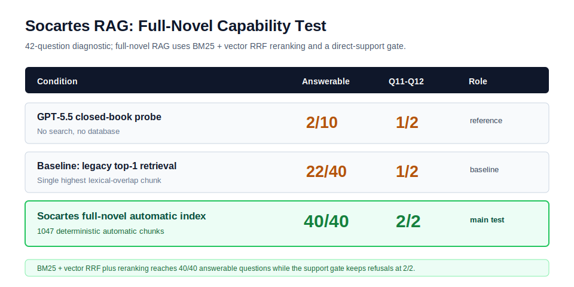

# Socartes RAG Capability Test on *The Haunted Pajamas*

## Abstract

This report evaluates whether Socartes can answer obscure fiction questions from a supplied local corpus while refusing unsupported questions. The main Socartes condition uses the full Project Gutenberg text of *The Haunted Pajamas* automatically split into 1047 chunks.

The repaired full-novel retriever uses hybrid recall with Reciprocal Rank Fusion (BM25 top 200 plus vector recall top 200), a 300-candidate rerank pool, heuristic support-aware reranking, `top_k=5`, `adjacent_hops=1`, title-term removal, and a direct-support refusal gate. The default embedding path uses `qwen3-embedding-0.6b` through an OpenAI-compatible `/embeddings` endpoint when an embedding API key is available, can fall back to a cached local `all-MiniLM-L6-v2` ONNX model, and finally falls back to a deterministic hashed baseline for dependency-free reproduction. The vector store uses `sqlite-vec` when installed and otherwise uses in-memory cosine search. It answers the original 10 of 10 source-supported questions and 30 of 30 extension questions, for 40 of 40 answerable questions overall, while correctly refusing 2 of 2 unsupported controls.



## Research Question

Can the Socartes RAG retriever, using the same full-novel corpus but a repaired hybrid retrieval pipeline, retrieve the right evidence from a full novel and enforce refusal when the local corpus does not support the question?

## Corpus

The corpus is Project Gutenberg EBook #33780, *The Haunted Pajamas* by Francis Perry Elliott:

- Book page: <https://www.gutenberg.org/ebooks/33780>
- Plain text source: <https://www.gutenberg.org/ebooks/33780.txt.utf-8>
- Local fixed copy: `experiments/data/haunted_pajamas_33780.txt`

The script removes the Project Gutenberg start/end boilerplate, then chunks the remaining body by paragraph accumulation with `chunk_target_words=100`. With the committed text this yields:

| Item | Value |
| --- | ---: |
| Body word count | 80,408 |
| Automatic chunk count | 1,047 |
| Retrieval system | `StoryRagIndex` with BM25 plus vector RRF recall, reranking, and adjacent evidence aggregation |
| Tie break | same-score chunks choose the earliest chunk position |

## Conditions

| Condition | Role |
| --- | --- |
| GPT-5.5 closed-book probe | Existing reference data; no search and no database access. |
| Baseline: legacy top-1 lexical retrieval | Previous Socartes retrieval setting before the top-k adjacent evidence repair. |
| Socartes full-novel automatic index | Main experiment over the full automatic index. |

## Questions

The diagnostic now has 42 questions. Q1-Q10 are the original answerable regression set, Q13-Q42 are answerable full-novel detail questions, and Q11-Q12 are unsupported controls.

| ID | Expected behavior |
| --- | --- |
| Q1 | Retrieve the package sender/name-address evidence. |
| Q2 | Retrieve the Carlton/Mastermann identity evidence. |
| Q3 | Retrieve the red silk muffler evidence. |
| Q4 | Retrieve the unpaid-debt evidence. |
| Q5 | Retrieve the Hickey's Pride cigar evidence. |
| Q6 | Retrieve the two-for-five evidence. |
| Q7 | Retrieve the suit-of-pajamas evidence. |
| Q8 | Retrieve the Old Memphis Tuffles evidence. |
| Q9 | Retrieve the little-spider evidence. |
| Q10 | Retrieve the tarantula evidence. |
| Q11 | Refuse the Sherlock Holmes question. |
| Q12 | Refuse the spaceship-captain question. |
| Q13 | Retrieve the Boston-arrival evidence. |
| Q14 | Retrieve the little-red-snakes cord evidence. |
| Q15 | Retrieve the Foxy impostor evidence. |
| Q16 | Retrieve the Doozenberry distinguished-scientist evidence. |
| Q17 | Retrieve the Si-Ling-Chi lost-silk evidence. |
| Q18 | Retrieve the red-whale car comparison. |
| Q19 | Retrieve the five-hundred-dollar reward evidence. |
| Q20 | Retrieve the Captain Clutchem evidence. |
| Q21 | Retrieve the chauffeur-under-the-pergola evidence. |
| Q22 | Retrieve the ruby/library evidence. |
| Q23 | Retrieve the good-excalibar evidence. |
| Q24 | Retrieve the Miss-Billings correction evidence. |
| Q25 | Retrieve the judge's my-son claim evidence. |
| Q26 | Retrieve the golden-humming-birds dream evidence. |
| Q27 | Retrieve Jenkins' scrimmage wording. |
| Q28 | Retrieve the phusiotus bug guess. |
| Q29 | Retrieve the phanaeus-carnifex bug identification. |
| Q30 | Retrieve the Sleepy Hollow and Pocantico Hills drive evidence. |
| Q31 | Retrieve the fragrant-pine-cones hearth evidence. |
| Q32 | Retrieve the Manchurian railway evidence. |
| Q33 | Retrieve the burglar's "mine now to keep forever" ruby evidence. |
| Q34 | Retrieve the petticoat-unknown-in-China evidence. |
| Q35 | Retrieve Wilkes' "jimmies" description of Billings. |
| Q36 | Retrieve Lightnut's plan to send the pajamas to Billings. |
| Q37 | Retrieve the four-curs dog-fight detail. |
| Q38 | Retrieve the "disgrace to an honored name" hallway evidence. |
| Q39 | Retrieve Frances' lovely-crimson face and neck evidence. |
| Q40 | Retrieve the young fellow's "a bit sulky" description. |
| Q41 | Retrieve the professor's proposed call on Billings. |
| Q42 | Retrieve the narrator's near loss of consciousness. |

## Main Results

| Condition | Original Q1-Q10 | New Q13-Q42 | Overall answerable | Correct refusal Q11-Q12 | Source form |
| --- | ---: | ---: | ---: | ---: | --- |
| GPT-5.5 closed-book probe | 2/10 | not run | 2/10 | 1/2 | none |
| Socartes full-novel automatic index | 10/10 | 30/30 | 40/40 | 2/2 | chunk ID |

The main RAG result after adding Q33-Q42 is 40/40 answerable retrieval and 2/2 correct refusal on the full-novel automatic index.

## Repair Ablation

| Configuration | Original Q1-Q10 | New Q13-Q42 | Overall answerable | Correct refusal Q11-Q12 |
| --- | ---: | ---: | ---: | ---: |
| Baseline: legacy top-1 lexical retrieval | 7/10 | 15/30 | 22/40 | 1/2 |
| Hybrid RRF + rerank without support gate | 10/10 | 30/30 | 40/40 | 0/2 |
| Full setting: hybrid RRF + rerank plus support gate | 10/10 | 30/30 | 40/40 | 2/2 |

The ablation separates the two failure modes. The legacy top-1 baseline misses Q2, Q5, and Q10 because the answer phrase is in a lower-ranked or adjacent chunk. Hybrid RRF recall and reranking recover those answer passages and the harder Q13-Q42 extension set, but they also widen the evidence window enough for both unsupported controls to become false hits. The direct-support gate fixes this by refusing Q11 and Q12 when the retrieved evidence does not directly support the requested target.
The added Q13-Q42 extension shows why simple top-k expansion is not enough: several correct passages are outside the lexical top-100 window or require relation matching rather than direct token overlap.

## Baseline Error Analysis

Within the original Q1-Q10 set, the failed answerable questions in the legacy top-1 baseline are Q2, Q5, and Q10. They are not coverage failures; the evidence exists in the automatic index. They are retrieval-window failures caused by selecting only one lexical-overlap chunk. Across all 40 answerable questions, the same legacy baseline reaches 22/40, leaving 18 retrieval misses that the hybrid pipeline recovers.

| ID | Chosen chunk | First evidence rank | Interpretation |
| --- | --- | ---: | --- |
| Q2 | `full-novel-auto-0004` | 23 | The Carlton evidence is present, but several earlier chunks tie or beat it on generic overlap with `Jenkins` and `Mastermann`. |
| Q5 | `full-novel-auto-0019` | 4 | The Hickey's Pride evidence is near the top but misses top-3 under pure word-overlap ranking. |
| Q10 | `full-novel-auto-0041` | 30 | The tarantula evidence is nearby but receives only one overlapping query term, while earlier pajama-leg chunks tie at score 2. |

Q11 and Q12 fail in the no-support-gate ablation for different weak-match reasons. Q11 asks who kills Sherlock Holmes, and wide retrieval pulls in story passages containing names and violence-adjacent context even though no Sherlock Holmes answer exists in the novel. Q12 asks for a spaceship captain; the novel contains a real `Captain` name, Captain Clutchem, in an unrelated police context, so token overlap sees `captain` and `name` and returns a false hit. The repaired support gate requires the target terms from the question to appear in the retrieved evidence, so it refuses both controls rather than converting weak overlap into grounded answers.
## Extended-Question Error Analysis
Before the hybrid repair, Q16, Q17, Q19, Q21, and Q22 failed even though each expected answer existed in the automatic full-novel index. Their first matching evidence was outside the final evidence window: Q16 and Q17 first appeared at rank 7, Q21 at rank 16, Q22 at rank 10, and Q19 at rank 62.
The later Q23-Q32 extension exposed the next limit of pure lexical recall. Q23 first appeared at lexical rank 287, Q27 at rank 542, and Q29 at rank 67. Q24 appeared at rank 29 but required the reranker to prefer the exact "Miss Billings" correction passage over generic Frances/Lightnut context. Hybrid RRF recall brings vector candidates into the candidate pool, and heuristic support-aware reranking selects the passage that directly answers the question. The added Q33-Q42 diagnostic stays correct under the same pipeline.

## Interpretation

This experiment shows that Socartes can provide verifiable chunk IDs and correct refusal behavior on a full corpus when retrieval combines lexical recall, vector recall, reranking, adjacent evidence aggregation, and a direct-support gate.

The main claim should stay scoped to this implementation and corpus: Socartes can ground 40 of 40 answerable diagnostic questions in a local full-novel index and refuse the two unsupported controls. Broader robustness still requires follow-up work such as larger multi-corpus tests, learned cross-encoder reranking, and stronger semantic support checking.

## Reproducibility

Run the deterministic experiment:

```bash
python experiments/full_novel_eval.py
```

The script writes:

```bash
experiments/results/full_novel_eval.json
```

Focused RAG unit tests still pass:

```bash
pytest tests/test_story_rag.py -q
```

Relevant files:

- `experiments/full_novel_eval.py`
- `experiments/data/haunted_pajamas_33780.txt`
- `experiments/results/full_novel_eval.json`
- `backend/socartes_backend/story_rag.py`
- `tests/test_story_rag.py`
